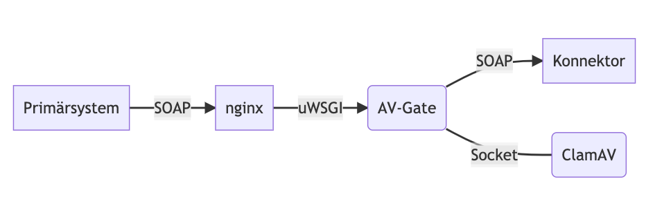
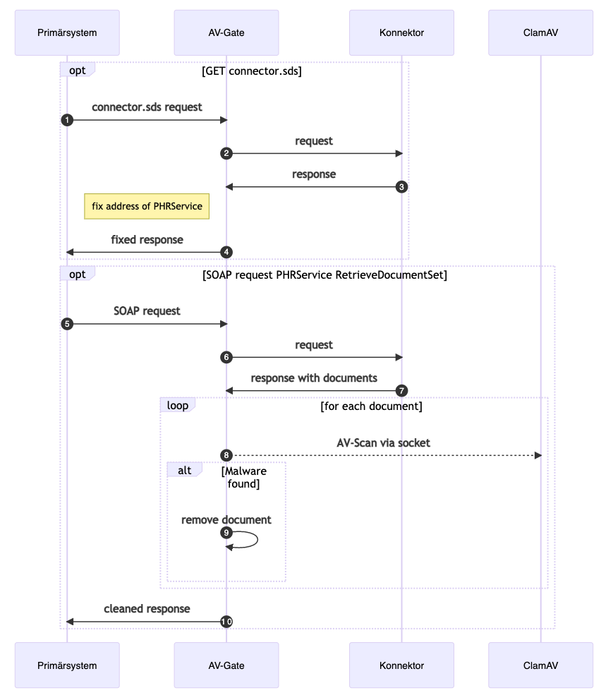

  
  
# Electronic Health Record System (Anti-Virus-Gate)

---

  
Table of Contents

  <ol>
    <li><a href="#Dokumentation">Dokumentation </a></li>
    <li><a href="#release-notes">Release Notes</a></li>
    <li><a href="#license">License</a></li>
    <li><a href="#contributions">Contributions</a></li>
    <li><a href="#contact">Contact</a></li>
  </ol>

   

## Dokumentation

## Wichtiger Hinweis
> Die hier dargestellte Antivirus-Lösung basiert auf der elektronischen Patientenakte der Version 2 (bis einschließlich ePA Version 2.6). 
Für die ePA der Version 3 ("ePA für alle" bzw. "ePA Opt-Out") ist sie nicht anwendbar.

___

## AV-Gate

Proxy für den Antivirus-Scan von Dokumenten zu der elektronischen Patientenakte (ePa). Dieser Proxy wird zwischen dem Konnektor der Gematik und den Primärsystemen geschaltet und überprüft sämtliche Dokumente der ePA vor der Übertragung an die Primärsysteme. 

Bei einem Fund von Malware wird das Dokument aus der Übertragung herausgenommen. Stattdessen wird eine Fehlermeldung für das entsprechende Dokument an das Primärsystem übergeben. Veränderungen an dem Repository der ePA selbst werden nicht vorgenommen.

Alternativ kann das Dokument bei Fund von Maleware durch eine Datei gleichen Types (Mime-Type) ersetzt werden. In diesem Fall wird der Payload des Soap-Responses nicht verändert. Dies ist notwendig, wenn das Primärsystem die Fehlermeldungen nicht verarbeiten kann. Die Ersatz-Dokumente liegen in dem Unterverzeichnis `replacements` und enthalten jeweils den Hinweis:

> Das Dokument wurde ersetzt, weil beim originären Dokument potentiell schadhafter Code entdeckt wurde.  
Das Original wird nicht ausgeliefert. 

Für den AV-Scan wird die open-source Lösung [ClamAV](https://www.clamav.net/) genutzt. Es erkennt schadhaften Code auch in Anhängen zu PDF, Excel und Word und OpenOffice Dokumenten. Testdateien mit der harmlosen [EICAR](https://www.eicar.org/?page_id=3950) Test-Signatur befinden sich für alle Mime-Typen im Verzeichnis `testfiles`. Nachdem Virenscanner regelmäßig auch bei den EICAR Testfiles aufschreien, wurden die Testfiles und Samples in einem zip-File abgelegt (password ist password).

Alternative AV-Scanner können nicht verwendet werden, da keine andere der bekannten Lösungen über eine programatische Schnittstelle für den Scan verfügt.

Macros in Excel und Word-Dokumenten sind für die zugelassenen Dateitypen (.xlsx .docx) nicht möglich bzw. enthalten. (Die Entsprechenden Dateitypen für Dokumente mit Macro  lauten .xlsm und .docm)

## Architektur und Funktionsweise

Das AV-Gate fungiert als Proxy zwischen Primärsystem und Konnektor. Die Verbindungen zwischen Primärsystem und NGINX sowie zwischen AV-Gate und Konnektor sind TLS gesichert. Die Requests an den Konnektor sind technisch komplett getrennt von den Requests an das AV-Gate (bzw. dem NGINX).

Die Autorisierung für den Konnektor wird bei Basic-Auth aus dem ursprünglichen Request übernommen. Client-Zertifikate müssen je Konnektor für das AV-Gate gesondert konfiguriert werden; eine Übername aus dem Request ist hier nicht möglich.

Die Verbindung zum ClamAV Dienst erfolgt über unix Socket. Daher muss der clamd auf der gleichen Maschine installiert sein.

Die Trennung zwischen NGINX und AV-Gate wurde aus Gründen der Übersichtlichkeit weggelassen.

1: Request der connector.sds  
Die connector.sds ist ein Verzeichnis der Service-Adressen.

2: Request an den Konnektor  
Hier wird ein neuer Request erzeugt (kein Forward oder Proxy). Der Request aus 1 wird gehalten.

4: Die Adresse für PHRService, welche den Endpunkt RetrieveDocumentSet enthält wird durch die Adresse des AV-Gates ersetzt. Diese wird aus dem Request an das AV-Gate ermittelt.

7: Response vom Konnektor
Der Response beinhaltet neben SOAP-Response auch die Dokumente als [XOP](https://de.wikipedia.org/wiki/XML-binary_Optimized_Packaging).

Responses zu anderen Endpunkten als RetrieveDocumentSet werden direkt an das Primärsystem weitergegeben.

8: AV-Scan
Die aus dem Response extrahierten Dokumente werden via socket stream an den clamd übergeben. Die Dateien werden nicht im Filesystem gespeichert. Die Latenz durch den Scan ist sehr gering (<100ms).

9: Remove Document  
Der XOP Teil der Nachricht für die betroffenen Dokumente wird entfernt und eine Fehlermeldung wird in den SOAP-Response geschrieben.
Alternativ wird hier das Dokument ersetzt und der SOAP-Response ansonst nicht verändert.

Der Ersatz der schadhaften Dokumente erfolgt mit den jeweiligen Dateien aus dem Verzeichnis `replacements'. Es sind für folgende Dateitypen/Mime-Typen Dokumente vorhanden:
- application/pdf
- image/jpeg
- image/png
- image/tiff
- text/plain
- text/rtf
- application/xml
- application/hl7-v3
- application/pkcs7-mime
- application/fhir+xml

### Office Dokumente
- application/vnd.openxmlformats-officedocument.wordprocessingml.document (.docx)
- application/vnd.openxmlformats-officedocument.spreadsheetml.sheet (.xlsx)
- application/vnd.oasis.opendocument.text (.odt)
- application/vnd.oasis.opendocument.spreadsheet (.ods)

Die Office-Dokumente sind in der aktuellen Version von ePA nicht mehr zugelassen, dennoch werden diese hier noch berücksichtigt, weil bestehende Dokumente unverändert ausgeliefert werden.

## ClamAV

Der Virenscanner läuft als Daemon. Die Aktualisierung der Viren-Signaturen erfolgt über einen eigenen Dienst. 

- [Installation](https://docs.clamav.net/manual/Installing.html)
- [SignatureManagement](https://docs.clamav.net/manual/Usage/SignatureManagement.html)

## Installation

Es werden benötigt:
- Python 3.8 
- uWSGI 1.19 
- NGINX 1.18.0
- ClamAV 0.105

Bislang wurde als Host-System Ubuntu Server 20.04.3 LTS verwendet. Die oben genanten Versionen entsprechen dieser Konfiguration. 

1. ClamAV   
/etc/clamav/clamd.conf  
`LocalSocket /tmp/clamd.socket`

2. Signaturen laden  
/etc/clamav/freshclam.conf   
`sh> freshclam`

1. NGINX   
Eine vollständig Beispielkonfiguration `nginx.conf` liegt bei. Ports, SSL-Zertifikate und ggf. Socket müssen angepasst werden. Angaben der Ports als Range sind seit NGINX 1.15.10 möglich.

1. uWSGI   
Beispieldatei `uwsgi.ini` liegt bei. Socket und chdir müssen angepasst werden. Virtualenv kann weggelassen werden, wenn auf dem Server keine weiteren, anderen Python-Versionen benötigt werden.

5. AV-Gate  
Dateien av_gate.py, av_gate.ini, requirements.txt in ein Programmverzeichnis kopieren (z.B. /usr/local/av_gate/). 
`sh> pip3 install -r requirements.txt` - oder mit `pip`, wenn pip3 nicht verfügbar.  
Der Pfad für den Socket in `av_gate.ini` ist ggf anzupassen.

## Konfiguration

In der `av_gate.ini` ist für jeden Konnektor eine Gruppe anzulegen. Der Gruppenname beschreibt das Routing über IP-Adresse mit Port `[<ip-address>:<port]` - oder aber ausschließlich über den Port `[*:<port>]`. Gruppen mit IP-Adresse werden vor den Gruppen ohne IP-Adressen berücksichtigt.

> Auf die Verwendung von Namen statt IP-Adressen wurde verzichtet, weil ein Großteil der Primärsysteme keine Namen in der Konfiguration verwenden kann.

Für jede Konnektor (jede Gruppe) kann konfiguriert werden:
- konnektor = https://<host><port>
- ssl_verify = true  
Die Zertifikate des Konnektors werden auf Gültigkeit überprüft. Verbindungen mit ungültigen (auch selfsigned) Zertifikaten werden abgelehnt.
- ssl_cert = <pfad.crt>  
- ssl_key = <pfad.key>  
Client-Zertifikat für Autorisierung gegenüber Konnektor. Die Zertifikate können als als .crt oder .pem hinterlegt werden und dürfen nicht verschlüsselt sein.

Auf jeden Arbeitsplatzrechner muss in der Konfiguration der Primärsysteme die IP-Adresse des AV-Gates als Konnektor eingetragen werden.

> **Warnung:** Wird auf einem Arbeitsplatzrechner der Konnektor nicht angepasst, erfolgt kein AV-Scan der Dokumente! Das Primärsystem wird aber dennoch wie bisher auch funktionieren - dies lässt sich technisch auch nicht verhindern.

Das Logging des AV-Gates erfolgt über uWSGI.
## Docker

Das Dockerfile ist vollständig lauffähig und soll die Installation veranschaulichen. Es es nicht empfehlenswert, das Docker-Image für den produktiven Einsatz zu verwenden, da es aufgrund fehlender Threads sehr ineffizient ist. Die Logs wurden nicht für Docker optimiert.

## Primärsysteme
Das AV-Gate wurde für folgende Primärsysteme getestet:

| Primärsystem | Version | Status | Anmerkung |
|---|---|---|---|
| Dedalus - Orbis | | voll funktionsfähig | `proxy_all_services` muss gesetzt sein |
| medatixx - x.concept | | voll funktionsfähig |  |
| KIS - iMedOne | | voll funktionsfähig | `proxy_all_services` muss gesetzt sein |

---

---
## Release Notes
See [ReleaseNotes.md](./ReleaseNotes.md) for all information regarding the releases.

## License
 
Copyright 2024 gematik GmbH
 
Licensed under the Apache License, Version 2.0 (the "License"); you may not use this file except in compliance with the License.
 
See the [LICENSE](./LICENSE) for the specific language governing permissions and limitations under the License.
 
Unless required by applicable law the software is provided "as is" without warranty of any kind, either express or implied, including, but not limited to, the warranties of fitness for a particular purpose, merchantability, and/or non-infringement. The authors or copyright holders shall not be liable in any manner whatsoever for any damages or other claims arising from, out of or in connection with the software or the use or other dealings with the software, whether in an action of contract, tort, or otherwise.
 
The software is the result of research and development activities, therefore not necessarily quality assured and without the character of a liable product. For this reason, gematik does not provide any support or other user assistance (unless otherwise stated in individual cases and without justification of a legal obligation). Furthermore, there is no claim to further development and adaptation of the results to a more current state of the art.
 
gematik may remove published results temporarily or permanently from the place of publication at any time without prior notice or justification.

## Contributions

This repository is for information. Updates, fixes and improvements are not handled via GitHub contributions.
Therefor submission of issues or pull requests is not recommended. Please contact us via gematik website (see <a href="#contact">Contact</a> below) 

## Contact

Please use the contact sheet https://fachportal.gematik.de/kontaktformular and choose "elektronische Patientenakte (ePA)" as request category in drop-down list "Thema der Anfrage/Kategorien".
