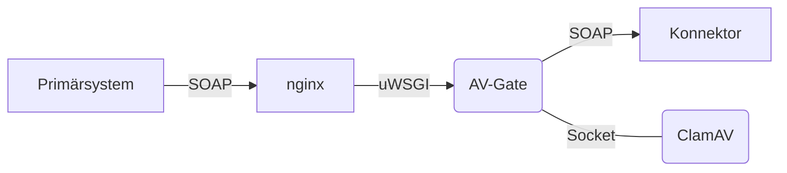
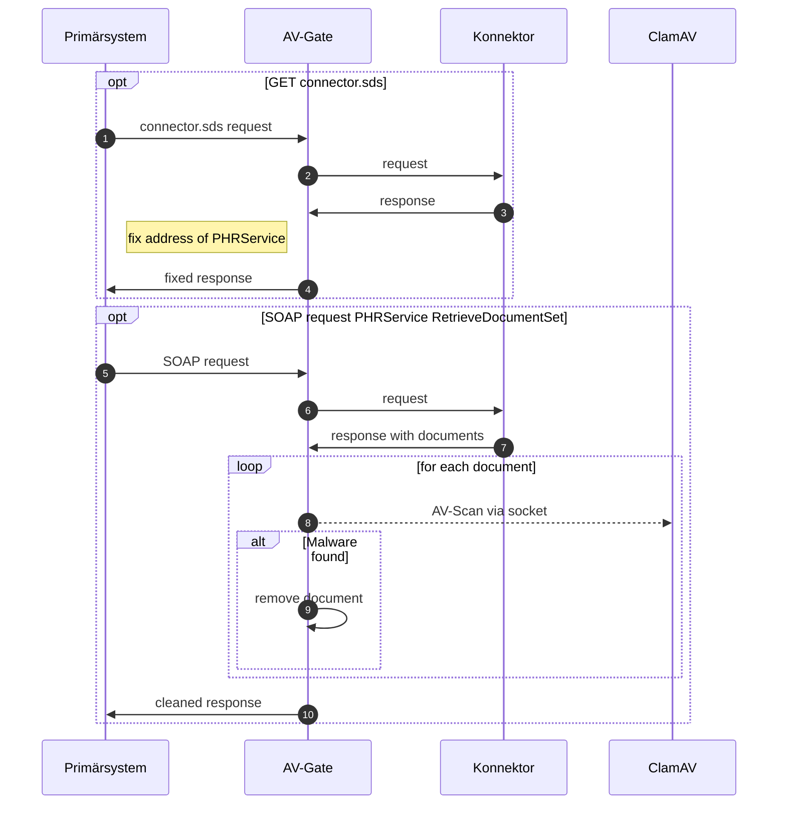

# Diagramme

## Architektur

```mermaid 
graph LR
PS[Primärsystem] --> |SOAP| N[nginx]
N --> |uWSGI| G(AV-Gate)
G -->|SOAP| K[Konnektor]
G ---|Socket| C(ClamAV)
```

## Sequence

```mermaid 
sequenceDiagram
autonumber
opt GET connector.sds
Primärsystem ->> AV-Gate: connector.sds request 
AV-Gate ->> Konnektor: request
Konnektor ->> AV-Gate: response
note right of Primärsystem: fix address of PHRService
AV-Gate ->> Primärsystem: fixed response
end

opt SOAP request PHRService RetrieveDocumentSet
Primärsystem ->> AV-Gate: SOAP request 
AV-Gate ->> Konnektor: request
Konnektor ->> AV-Gate: response with documents
loop for each document
AV-Gate -->> ClamAV: AV-Scan via socket
alt Malware found
AV-Gate ->> AV-Gate: remove document
end
end
AV-Gate ->> Primärsystem: cleaned response
end
```

